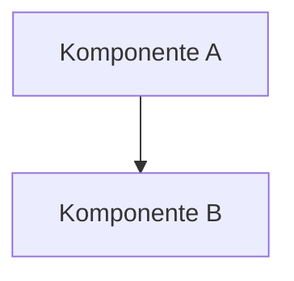

# Coding-Agent — Notiz PWA

## 0. Workspace-Struktur

Dieser Workspace besteht aus **zwei Ordnern**:

| Rolle | Pfad |
|---|---|
| **Code-Projekt** (auf GitHub gespiegelt) | `c:\xampp\htdocs\files\Notiz PWA\` |
| **Obsidian Vault** (Doku, Notizen, TODOs) | `C:\Users\bades\OneDrive\Desktop\Ideen\Projekte\` |

Projektordner im Vault: `Notiz PWA\`

---

### Session-Protokoll (Pflicht — keine Ausnahmen)

**Zu Beginn jeder Session — als allererste Aktion:**

Lese:
```
C:\Users\bades\OneDrive\Desktop\Ideen\Projekte\Notiz PWA\Recent.md
```

**Am Ende jeder Session — als allerletzte Aktion:**

Schreibe oben in `Recent.md` (neueste Einträge zuerst):

```markdown
## YYYY-MM-DD (Kurztitel der Arbeit)

### Kontext
Ein Satz: Was war der Ausgangspunkt / Wunsch des Nutzers?

### Neue Dateien
- `pfad/datei.ext` — Warum?

### Geänderte Dateien
- `pfad/datei.ext` — Was und warum?

### Ausgeführte Aktionen
- `<befehl>`: ✅/❌ Ergebnis

### Offene Punkte / Nächste Aufgaben
- [ ] Was noch fehlt
```

---

### Vault-Struktur für dieses Projekt

| Inhalt | Pfad (relativ zu Vault-Root) |
|---|---|
| Session-Log | `Notiz PWA\Recent.md` |
| Technische Dokumentation | `Notiz PWA\README.md` |
| Tasks / TODOs | `Notiz PWA\Backlog.md` |

---

## Obsidian Vault Konventionen

### Dateinamen

- Dashboards/Indizes: `00_<Bereich>_Dashboard.md`
- Themennotizen: `PascalCase` oder `Unter_strichen` — **keine Leerzeichen**
- Ordner: ebenfalls `PascalCase` oder `Unter_strichen`

### Frontmatter (Pflicht für neue Notizen)

```yaml
---
tags: [Notiz_PWA, <thema>]
aliases: ["Alternative Schreibweise"]
created: YYYY-MM-DD
---
```

### Wiki-Links

```markdown
[[DateiName]]                       ← einfacher Link
[[DateiName|Anzeigename]]           ← mit Label
[[DateiName#Abschnittsüberschrift]] ← auf Abschnitt
```

Niemals absolute Pfade (`[[C:\...\Datei]]`).

**Nach jeder neuen Notiz:**
1. Link im Dashboard oder Index eintragen
2. Neue Notiz verlinkt mind. 2–3 verwandte Themen
3. Keine Orphaned Notes

### Callouts

```markdown
> [!note] Hinweis
> [!tip] Tipp
> [!warning] Achtung
> [!example] Beispiel
```

### Mermaid

```markdown

```

---

## Über die App

Offlinefähige Notiz Progressive Web App

---

## 1. Prioritäten

1. Keine Nutzerdaten verlieren.
2. Kernfunktionalität zuverlässig halten.
3. Sicherheit und Datenschutz wahren.
4. Zielplattform optimal bedienen.
5. Kleine, verständliche und modulare Lösungen bevorzugen.
6. Dokumentation und Konfiguration aktuell halten.

---

## 2. Technischer Rahmen

Verwendete Technologien:
Next.js 15, React 19, Tailwind CSS v4, Zustand, PocketBase, Framer Motion, next-pwa

Keine neuen Frameworks oder Bibliotheken einführen, wenn die Aufgabe dies nicht zwingend erfordert.

---

## 3. Wichtige Verzeichnisse

```text
src/
  app/            → Next.js App Router (Routen und Seiten)
  components/     → Wiederverwendbare UI-Komponenten
  hooks/          → Custom React Hooks
  store/          → Zustand Store (Zustandsverwaltung)
  lib/            → PocketBase Client und Hilfsfunktionen
```

Vor neuen Dateien immer prüfen, ob bereits ein passendes Modul existiert.

---

## 4. Architekturregeln

- Offline-First: Notizen lokal speichern und mit PocketBase synchronisieren.
- Separation of Concerns: UI-Komponenten getrennt von Logik (Zustand/Sync).

---

## 5. Sicherheit und Datenschutz

- Lokale Daten verschlüsseln/sicher aufbewahren.
- PocketBase Rule Validation beachten.

---

## 6. Arbeitsweise

1. `Recent.md` im Vault lesen (Session-Start).
2. Relevante Dateien lesen.
3. Kleinste vollständige Änderung umsetzen.
4. Tests und Build ausführen.
5. `Recent.md` aktualisieren (Session-Ende).

Keine Tests als erfolgreich bezeichnen, wenn sie nicht ausgeführt wurden.

---

## 7. Prüfkommandos

```bash
# npm run dev
# npm run build
# npm run lint
```

---

## 8. Fertig-Kriterium

Fertig erst wenn: Funktion umgesetzt · Qualität geprüft · Prüfkommandos grün · `Recent.md` aktualisiert · offene Risiken benannt.

---

## Grundsatz

Die App muss auf Mobilgeräten offline zuverlässig funktionieren und Änderungen nahtlos synchronisieren.
